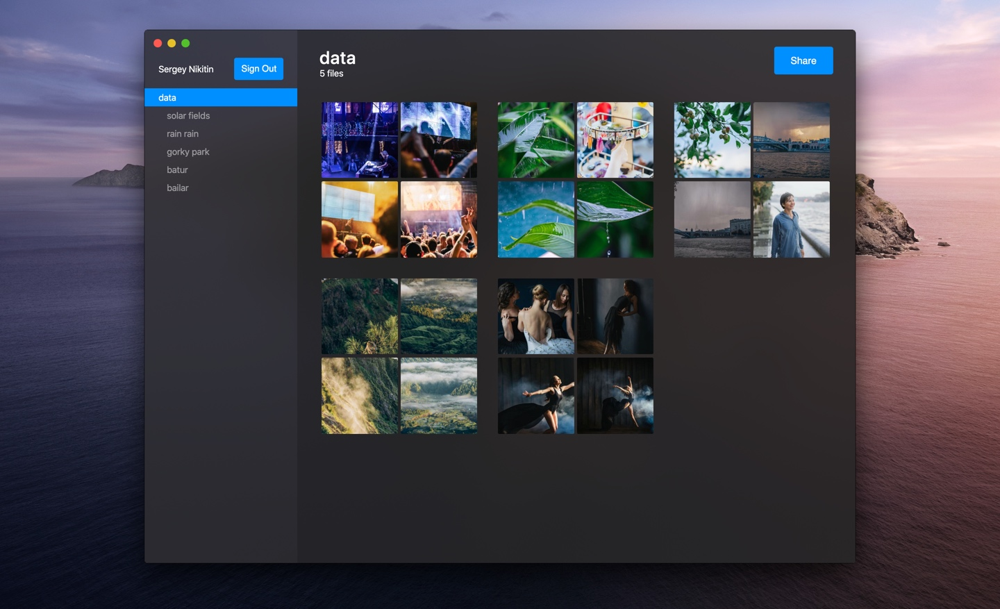

# Importa

Cloud media organizer that saves the time and traffic. Share your file management with anyone.

Importa is serverless so you can use own AWS backend for security reasons. Read [AWS Amplify Setup Instructions](https://aws-amplify.github.io/docs/).

---

The monorepo is powered by Lerna:
- [packages/backend](packages/backend/) - Backend configuration for AWS Amplify.
- [packages/desktop](packages/web/) - Electron/React web app.
- [packages/web](packages/web/) - React web app
- [wip] packages/mobile -  React Native (Expo) app

--- 

© [Sergey Nikitin](https://nikitin.dev)